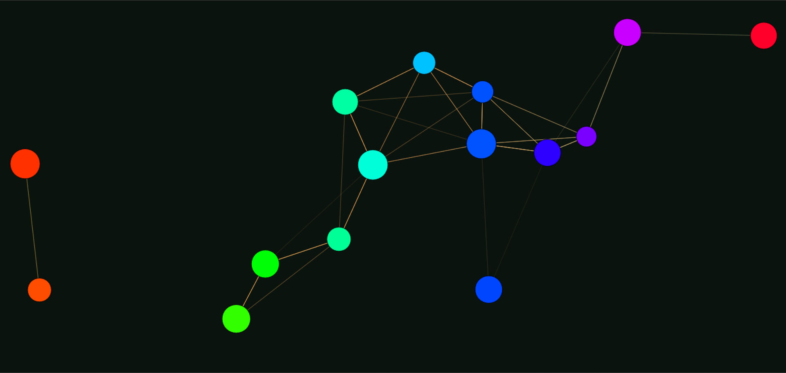
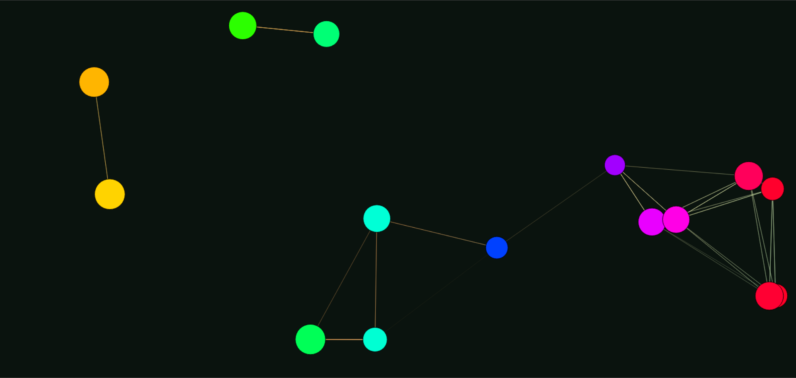

# Particles System
This project is a JavaScript implementation of a dynamic particle effect rendered on an HTML canvas. It creates an animated visual representation using particles that move within the canvas, interacting with each other and forming connections.

    
    

# Features
- Particle Dynamics
  - Particles move randomly within the canvas, bouncing off the edges when they reach them.
  - Each particle has a random speed and direction upon initialization, creating a dynamic movement pattern.
- Gradient Background
  - The canvas has a gradient background that transitions smoothly from one color to another, adding depth to the visual effect.
- Particle Connections
  - Particles within a certain distance from each other are connected by lines.
  - The transparency of the lines varies based on the distance between particles, creating a fading effect as particles move further apart.

# Credits
This project is not a work of my own imagination. I followed youtube tutorials of <a  target="#" href="https://www.youtube.com/watch?v=5dIbK0auaB8">Franks Labrotary</a>
 
His makes animations using HTML canvas element from scratch and his work as a JavaScript content creator is simply amazing.
I was amazed by this animation and how visually appealing it was, that too in so minimillistic code. I loved this work of his and his other works too.
 
Thankyou!, I had a great time learning and implementing
